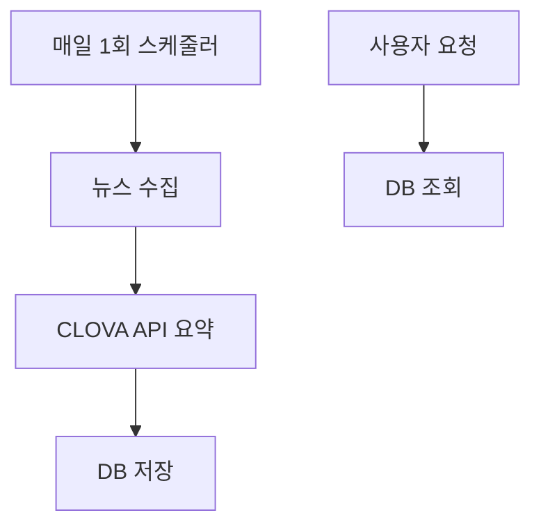

# AI에 DB 저장이 왜 필요할까?

## 📌 배경과 문제 정의
### AI 비용 문제
- 사용자 요청마다 AI API 호출 발생
- 예측 불가능한 비용 발생 (트래픽에 비례)
- 중복된 뉴스에 대한 반복 요약 처리

### 사용자 경험 문제
- AI 요약 생성에 따른 느린 응답 시간
- 서비스 안정성 저하 위험
- 실시간성이 크게 중요하지 않은 뉴스 특성

## 💡 해결 방안

### 1. DB 저장 전략 도입


#### Before (DB 저장 전)
- 매 요청마다 AI API 호출
- 비용 통제 어려움
- 긴 응답 시간 (클로바 요약 시간)
- 서비스 불안정성

#### After (DB 저장 후)
- 하루 1회 일괄 처리
- 예측 가능한 비용
- 빠른 응답 (단순 db 조회)
- 안정적인 서비스

### 2. 효율적인 아키텍처 설계

#### 기존 문제점
- 서비스 간 책임 경계가 모호
- 데이터 흐름이 불명확
- 크롤링, 요약, 저장 서비스가 각각 독립적으로 존재
```typescript
// Before: 책임 소재가 불명확한 구조
class NewsCrawlingService { ... }
class NewsSummaryService { ... }
class StockNewsRepository { ... }
```

#### 개선: 오케스트레이션 패턴 도입
```typescript
// After: 명확한 책임과 데이터 흐름
@Injectable()
class NewsOrchestrationService {
  constructor(
    private newsCrawlingService: NewsCrawlingService,  // 크롤링 담당
    private newsSummaryService: NewsSummaryService,    // AI 요약 담당
    private stockNewsRepository: StockNewsRepository   // DB 저장 담당
  ) {}

  @Cron('19 15 0 * * *')
  async processNews(stockId: string) {
    // 1. 뉴스 수집
    const stockNewsData = await this.newsCrawlingService.crawling(stockName);
    
    // 2. AI 요약 생성
    const summarizedData = await this.newsSummaryService.summarizeNews(stockNewsData);
    
    // 3. DB 저장
    await this.stockNewsRepository.create(summarizedData);
  }
}
```

#### 개선 효과
- 명확한 책임 분리로 코드 유지보수성 향상
- 중앙 조정자(NewsOrchestrationService)를 통한 로직 파악 용이
- 각 서비스의 독립적인 테스트 가능
- 새로운 기능 추가가 용이한 구조

## 📊 개선 효과

### 유지보수 측면
- 코드베이스 이해도 향상
- 독립적인 서비스 테스트 가능
- 새로운 기능 추가 용이

## 💡 시사점
1. AI 서비스 설계 시 비용 효율성 고려 필수
2. 실시간성과 비용의 적절한 균형점 찾기 중요
3. 사용자 경험과 비용 효율성은 트레이드오프 관계가 아닐 수 있음
4. 명확한 아키텍처 설계가 장기적인 유지보수성 보장

## 🎯 결론
DB 저장 전략과 오케스트레이션 패턴을 도입함으로써, 비용 효율적이면서도 안정적인 AI 기반 뉴스 요약 서비스를 구축할 수 있었습니다. 이는 단순한 기술적 개선을 넘어, 서비스의 지속가능성과 확장성을 보장하는 기반이 되었습니다.